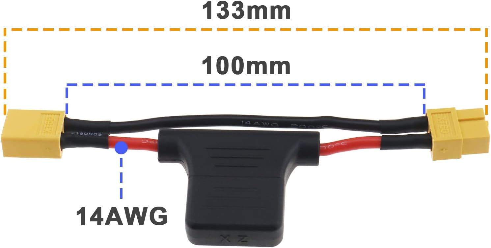
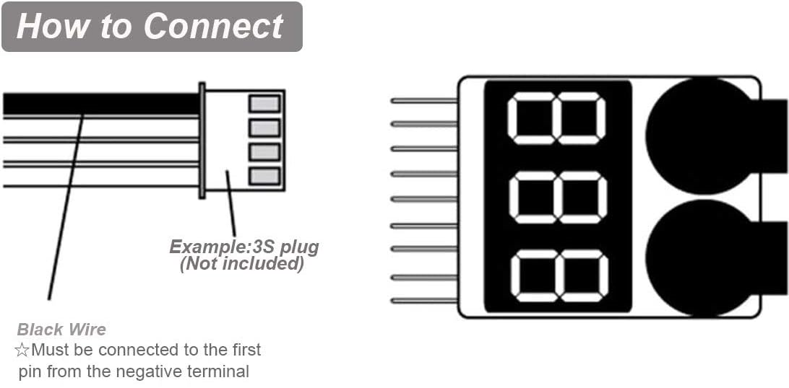
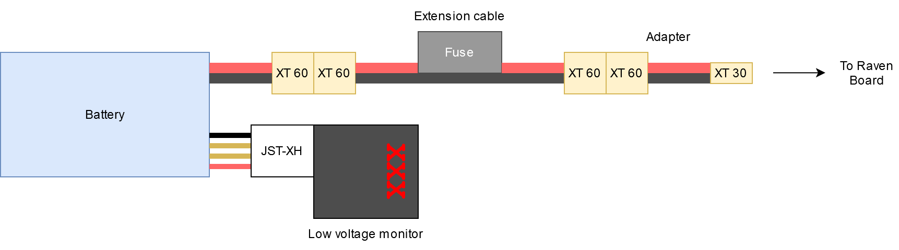

# kitbot-how-to
Guide for interacting with the KitBot

# Introduction
## Hardwares
MASLAB KitBot consists of two central components:  
1. A Raspberry Pi 5 computer - A powerful mini computer to run ROS 2 on Ubuntu 24.04

<p align="center">

</p>

2. Raven - MASLAB custom circuit board to handle power and interaction with actuators and sensors

MASLAB KitBot also includes motors with encoders and servos to mobilize the robot. Teams can opt to use other motors and servos. More about actuators will be covered in another guide.

Raven also includes an onboard inertial measurement unit (IMU) and Qwiic (https://www.sparkfun.com/qwiic) connector system to connect the Pi 5 to other sensors. More about how to use sensors will be covered in another guide. 

To power these devices LiPo batteries will be provided.
> [!CAUTION]
> LiPo batteries are **DANGEROUS**. Please review LiPo safety notes and attend LiPo lecture before using the kitbot with a battery.

## Softwares
The Raspberry Pi 5 is already set up with Ubuntu 24.04 and ROS 2. Communication with the Pi will be through the Pi's Ethernet connector or through the wireless network.

# Hardware Setup
> [!NOTE]
> As a soldering practice ~~and cost cutting effort 💸~~, some kitbot part requires a bit of soldering. If you are new to soldering, need a refresh for soldering, or having any question/concern/problem, please reach out to a MASLAB staff during lab hours for assistance.

## Motor
TODO: Add images
The wheel motors come with uncrimped power and encoder wires. Below is the color code for the motor.

<p align="center">

</p>

The Red and White pins are for powering the motor. They can be screwed into the motor terminal blocks (to be explained later). The other pins are for encoders to count how many revolution has the motor rotated. To easily connect and disconnect these pins in the future, we can solder wires with headers onto them:

1. Pull out a black, yellow, green, and blue wires from the precrimped cable sets. 

2. Cut each of them in half to have precrimped leads for 2 motors.

3. Strip and solder the uncrimped ends to the motor's uncrimped encoder wires of the same colors.

Your end motor should look like this below. Make 2 of them for the driving wheels.

## Raspberry Pi
The Raspberry Pi 5 requires an active cooler to properly cool the board during heavy computations (i.e. image processing). To install the cooler, follow the installation guide at: https://datasheets.raspberrypi.com/cooling/raspberry-pi-active-cooler-product-brief.pdf 

## Raven Board
### Soldering
TODO: Add images
#### Motor terminals
Raven uses terminal blocks to connect to motors. Solder at least 2 of these terminals to connect to the kitbot wheel motors. Each terminal block is for one motor.

#### Encoder pins
Each motor may be equipped with an encoder. Populate Raven's encoder ports with black, blue, yellow, and green headers.

#### Servo pins
A typical servo has 3 pins for power and signal. Populate Raven's servo ports with black, red, and yellow headers.

#### Switch pins
Raven also have switch ports that are connected to the Pi's GPIOs for buttons / limit switches. Polulate them with any two color like your team's unique board identifier 😁

#### Pi connector
Raven is connected to the Raspberry Pi 5 through the standard Raspberry Pi 40 pins connector. To populate it:

1. Install the connector such that the exposed pins go from the bottom (side with MASLAB logo) to the top (side with components). Please be careful about this direction! Ask MASLAB staff if you are not sure.

2. Solder the connectors.

### Pi connection
Raven is designed as a compact Raspberry Pi HAT (Hardware Attached on Top) board. It meant to be installed directly on top of the Pi 5. To properly secure the board to the Pi, follow the [installation video](https://vilros.com/pages/pi-5-active-cooler-compatible-case-instruction-video) but do not populate the plastic covers. Instead, use Raven board as the top cover and leave the bottom cover uninstalled. We can mount the assembly onto the kitbot later through the bottom standoffs.

### Motor connection
Raven supports up to 5 motors with 5 optional encoders. If using encoder, make sure the the motor is modified according to [Motor](#motor). 

Each motor [terminal block](#motor-terminals) has 2 screw ports for power and ground for each motor. The left most block is motor 1 and right most block is motor 5.

Each encoder port is made of a row of [black, blue, yellow, and green pins](#encoder-pins). The top most encoder port is for motor 1 and bottom most port is for motor 5.

To connect the motor power, loosen the screws of a terminal block, insert the power (red) wire into one screw ports and ground (white) into the other screw port, and tighten the screws.

> [!TIP]
> The order of the wire does not matter. Reversing them will reverse the rotation of the motor. Feel free to experiment and use whichever order makes the most sense for your software.

To connect the motor encoder, plug in the encoder wires, matching the colors into the encoder port of corresponding motor.

### Servo connection
Raven supports up to 4 servos. Each servo port is made of a column of [black, red, and yellow pins](#servo-pins). The left most servo port is for servo 1 and right most port is for servo 4.

To connect the servo, install the servo connector directly onto the servo pins, matching brown to black, red to red, and orange to yellow.

### Switch connection
Raven has 5 switches that gets connected to ground when closed. Each switch port is made of a row of [your team's favorite colors](#switch-pins). The left side of the port is connected to ground. The right side is as followed from top to bottom:
1. GPIO 6
2. GPIO 16
3. GPIO 5
4. GPIO 7
5. GPIO 19

### qwiic connection
Raven also have 2 qwiic ports to support qwiic devices such as another inertial measurement sensor, color sensor, GPS, and even an LCD. Behind the connectors are connection to the I2C ports of the Raspberry Pi. The left connector is for I2C port 1 and right connector is for I2C port 2. More information about qwiic connection system can be found here: https://www.sparkfun.com/qwiic 

## Battery
> [!WARNING]
> Information below are simply summary of LiPo safety notes for using the battery with the kitbot. For more details, please check LiPo safety notes.

### LiPo
The LiPo battery for the Pi is a LiPo battery with 3 cells connected in series (3S battery). The battery has an XT60 connector for power output and a JST-XH balancing lead for monitoring individual cells.  

<p align="center">

</p>

### Fused extension cable
For safety, a fused extension cable is required to be connected to the battery output when in use.  

<p align="center">

</p>

### XT60 to XT30 adapter
The battery connector on the Raven board is a XT30 connector instead of the full size XT60. Therefore, an adapter is required to be connected to the fused extension cable.

<p align="center">

</p>

### Low voltage monitor
Low voltage monitor is also required to be connected to the battery balancing lead (JST-XH) during use.

> [!IMPORTANT]  
> Please have the low voltage monitor connected to the battery balancing lead **as long as the battery is in use**. When not in use, feel free to remove the monitor and store the battery in the battery safe bag.

<p align="center">

</p>

> [!IMPORTANT]  
> The low voltage monitor is polarized. Please be careful when installing the balancing lead. The black wire should be connected to the first pin (BBX end) as shown in the previous picture. Below is a reference from older generation of the product.
> <p align="center">
> 
> </p>

### Full battery connection diagram

<p align="center">

</p>

> [!CAUTION]
> The battery will also power the Pi on through Raven board and conflicts with the USB-C power adapter. **DO NOT USE THE USB-C POWER ADAPTER WITH THE PI WHILE THE BATTERY IS PLUGGED IN**

# Software Setup
## Terminal
Many interaction with the Pi and using ROS will be through a [terminal](https://en.wikipedia.org/wiki/Command-line_interface). To simply put, a terminal is a software for interaction with the computer through text input. For Ubuntu, you can access the terminal in the software panel or use shortcut `Ctrl + Alt + T`.

If you have never used computer through a terminal before, please follow this tutorial to learn how to use the terminal: https://ubuntu.com/tutorials/command-line-for-beginners 

## ROS2 Setup
We have a ROS2 local setup guide to install ROS2 and VSCode on your personal computer and familiarize with both software. The guide is available at: https://github.com/MASLAB/ros2-setup

## Connect to Pi (SSH)
To connect to the Pi, we use [Secure Shell (SSH)](https://en.wikipedia.org/wiki/Secure_Shell) as the most barebone way to connect without a monitor and a keyboard. SSH is preinstalled in Ubuntu. SSH is a software to log in and open a terminal on the Pi through the network. The network connection can be through the `EECS-Labs` WiFi when in lab or `MIT` WiFi when anywhere else on campus or the Pi's Ethernet port (preferred).

### IP address
For SSH, we need the Pi's [IP address](https://en.wikipedia.org/wiki/IP_address). On WiFi, the IP address of your Pi is reported periodically on https://maslab.mit.edu/pollmemaybe. For Ethernet, connect the to the Pi through the Ethernet cable and the IP of the Pi is fixed at 192.168.1.1.

> [!TIP]
> For most reliable connection and for ROS message to communicate to your computer as well, please use Ethernet connection. MIT wireless network is set up to refresh the IP address of the Pi and causes frequent disconnection. It also blocks ROS messages from passing between the Pi and your computer. It is really only fine for starting up your robot on the field once you have developed your robot software.

### Account
We will also need a user account to log into the Pi. Please ask a MASLAB staff for username and password information.

### Login in
Once you have the IP address and information, open a terminal and use SSH with this command format.
```shell
ssh <username>@<ip-address>
```
When you use SSH to access a computer with a new IP address for the first time, SSH will return something like:
```shell
The authenticity of host '194.195.118.85 (194.195.118.85)' can't be established.
ED25519 key fingerprint is SHA256:wF2qILJg7VbqEE4/zWmyMTSwy3ja7be1jTIg3WzmpeE.
This key is not known by any other names
Are you sure you want to continue connecting (yes/no/[fingerprint])?
```
Enter `yes` to confirm and remember the Pi's network identity for future access. Then type the password as provided by MASLAB staff.

## Connect to Pi (VSCode Remote Window)
VSCode has an extension to remotely connect to the Pi's and open its folders directly on VSCode. The extension is available here: https://marketplace.visualstudio.com/items?itemName=ms-vscode-remote.remote-ssh 

Install and follow the [Getting started](https://marketplace.visualstudio.com/items?itemName=ms-vscode-remote.remote-ssh#getting-started) note with simple SSH host setup. 


