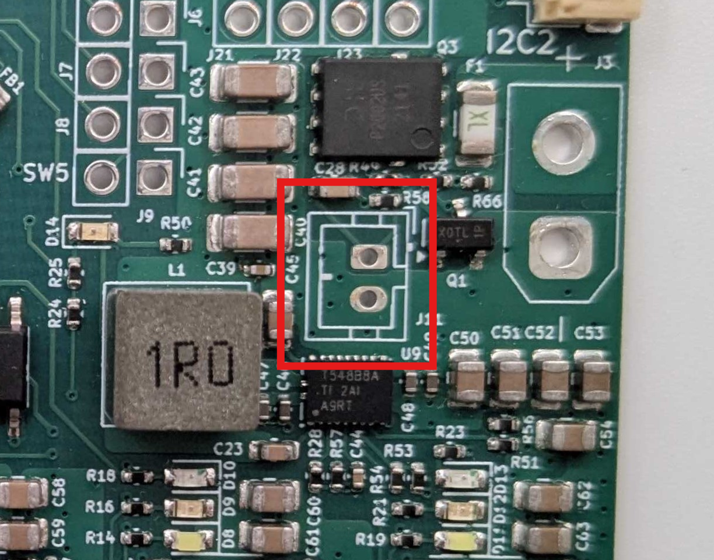
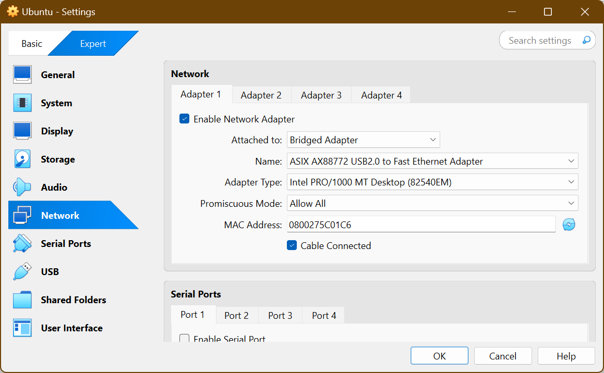

# KitBot how-to
Guide for interacting with the KitBot

# Introduction
## Hardwares
MASLAB KitBot consists of two central components:  
1. A Raspberry Pi 5 computer - A powerful mini computer to run ROS 2 on Ubuntu 24.04

<p align="center">

</p>

2. Raven - MASLAB custom circuit board to handle power and interaction with actuators and sensors

<p align="center">

</p>

MASLAB KitBot also includes motors with encoders and servos to mobilize the robot. Teams can opt to use other motors and servos. More about actuators will be covered in another guide.

Raven also includes an onboard inertial measurement unit (IMU) and qwiic (https://www.sparkfun.com/qwiic) connector system to connect the Pi 5 to other sensors. More about how to use sensors will be covered in another guide. 

To power these devices LiPo batteries will be provided.
> [!CAUTION]
> LiPo batteries are **DANGEROUS**. Please review [LiPo how-to](https://github.com/MASLAB/battery-how-to/blob/main/README.md) before using the kitbot with a battery.

## Softwares
The Raspberry Pi 5 is already set up with Ubuntu 24.04 and ROS 2. Communication with the Pi will be through the Pi's Ethernet connector or through the wireless network.

# Hardware Setup
> [!NOTE]
> As a soldering practice ~~and cost cutting effort 💸~~, some kitbot part requires a bit of soldering. If you are new to soldering, need a refresh for soldering, or having any question/concern/problem, please reach out to a MASLAB staff during lab hours for assistance.
> For soldering through-hole components, here is a good tutorial video: https://www.youtube.com/watch?v=DJH7VLGJ4fs
> For soldering cables together, here is another good tutorial video: https://www.youtube.com/watch?v=NSqPHQ1zQco

## Motor
<!-- TODO: Add images -->
The wheel motors come with uncrimped power and encoder wires. Below is the color code for the motor.

<p align="center">

</p>

The Red and White pins are for powering the motor. They can be screwed into the motor terminal blocks (to be explained later). The other pins are for encoders to count how many revolution has the motor rotated. To easily connect and disconnect these pins in the future, we can solder wires with headers onto them:

1. Pull out a black, yellow, green, and blue wires from the precrimped cable sets.

2. Cut each of them in half to have precrimped leads for 2 motors.

3. Strip and solder the uncrimped ends to the motor's uncrimped encoder wires of the same colors.

4. Make 2 of them for the driving wheels.

<!-- Your end motor should look like this below. Make 2 of them for the driving wheels. -->

## Raspberry Pi
The Raspberry Pi 5 requires an active cooler to properly cool the board during heavy computations (i.e. image processing). To install the cooler, follow the installation guide at: https://datasheets.raspberrypi.com/cooling/raspberry-pi-active-cooler-product-brief.pdf 

The Pi also requires a micro SD that stores all the system file. Your kit should include one inside an SD card adapter. This card is already preloaded with ROS2, Raven update scripts, and your team's repository.

## Raven Board

> [!IMPORTANT]
> When described using relative position (left, right, top, bottom, etc.), the board is assummed to be facing up (component side on top). The 40 pins (20x2) headers is "top". All components are installed on the component side unless mentioned otherwise. Header pins are installed with short side down and long side up.

<p align="center">

</p>

### Soldering
<!-- TODO: Add images -->
#### On button
Raven needs a power button to turn on. The connector to this power button is located near top right corner of the `1R0` cube (an inductor). Grab the power button cable, the power button connector, and the power button. Solder the connector, matching the outline on the board. Solder the power button cable to the power button.

<p align="center">

</p>


#### Battery connector
Raven uses an XT30 connector at the right most edge to connect to the battery. Install the connector and make sure that the shape of the connector matches the outline (flat edge toward top and angled edge toward bottom of board). Solder the connector.

> [!CAUTION]
> As a battery connector, soldering and using this connector incorrectly will likely destroy the Raven board AND the Pi if connected. Please make sure to follow the instruction, take a look at staff's reference board, and ask a MASLAB staff if you are unsure about anything.

<p align="center">

</p>

#### Motor terminals
Raven uses 5 terminal blocks around the bottom edge to connect to motors. Each terminal block is for one motor. Solder at least 2 of these terminals to connect to the kitbot wheel motors. Make sure that the opening points to the edge of the board.

<p align="center">

</p>

#### Encoder pins
Each motor may be equipped with an encoder. The encoder pins are 4x5 pins located on the left side, above 2 black buttons. Populate Raven's encoder ports with black, blue, yellow, and green headers from left to right.

<p align="center">

</p>

#### Servo pins
A typical servo has 3 pins for power and signal. The servo pins are 5x3 pins near the top right corner of the board. Populate Raven's servo ports with black, red, and yellow headers from top to bottom.

<p align="center">

</p>

#### Digital pins
Raven also have digital IO ports that are connected to the Pi's GPIOs for buttons / limit switches / digital output. They are 2x5 pins located left of the servo pins. Populate the right column with black headers and left with any color like your team's unique board identifier 😁

<p align="center">

</p>

#### Pi connector
Raven is connected to the Raspberry Pi 5 through the standard Raspberry Pi 40 pins connector. It is the 20x2 pins located at the top most edge of the board. To populate it:

1. Install the connector such that the exposed pins go from the bottom (side with MASLAB logo) to the top (side with components).

<p align="center">

</p>

2. Make sure the pins are perfectly square with the board and solder the pins. Misaligned pins may not fit on the Pi.

### Pi connection
Raven is designed as a compact Raspberry Pi HAT (Hardware Attached on Top) board. It meant to be installed directly on top of the Pi 5. To properly secure the board to the Pi, follow the [installation video](https://vilros.com/pages/pi-5-active-cooler-compatible-case-instruction-video) but do not populate the plastic covers. Instead, use Raven board as the top cover and leave the bottom cover uninstalled. We can mount the assembly onto the kitbot later through the bottom standoffs.

### Power button
The [power button](#power-button) you made previously plugs into the power connector. When the battery is connected, this button turns on the system. To turn off, shut down the Pi with Pi's power button (not Raven power button) or [command](#shutdown-pi).

### Motor connection
Raven supports up to 5 motors with 5 optional encoders. If using encoder, make sure the the motor is modified according to [Motor](#motor). 

Each motor [terminal block](#motor-terminals) has 2 screw ports for power and ground (GND) for each motor. The left most block is motor 1 and right most block is motor 5.

Each encoder port is made of a row of [black, blue, yellow, and green pins](#encoder-pins). The top most encoder port is for motor 1 and bottom most port is for motor 5. From black to green (or from left to right if you did not use colored header):

<center>

(Left to right)
| Black       | Blue       | Yellow | Green |
|-------------|------------|--------|-------|
| Hall ground | Hall power | C1     | C2    |

</center>

To connect the motor power, loosen the screws of a terminal block, insert the power (red) wire into one screw ports and ground (white) into the other screw port, and tighten the screws.

> [!TIP]
> The order of the wire does not matter. Reversing them will reverse the rotation of the motor. Feel free to experiment and use whichever order makes the most sense for your software.

To connect the motor encoder, plug in the encoder wires to corresponding signal. 

> [!TIP]
> If you are using the wheel motor you modified in [Motor](#motor), you can match the colors into the encoder port of corresponding motor. If you are using other motor, **check the datasheet and match the signals**. They may have slightly different names but they should all have power, ground, and two other signals. Like the motor, reversing the two signal also reverse the encoder count.

### Servo connection
Raven supports up to 4 servos. Each servo port is made of a column of [black, red, and yellow pins](#servo-pins). The left most servo port is for servo 1 and right most port is for servo 4. From black to yellow (or from top to bottom if you did not use colored header):

<center>

(Top to bottom)

<table>
  <tr>
    <th>Black</th>
    <td>Ground</td>
  </tr>
  <tr>
    <th>Red</th>
    <td>Power (5V)</td>
  </tr>
  <tr>
    <th>Yellow</th>
    <td>Signal</td>
  </tr>
</table>

</center>

To connect the servo, install the servo connector directly onto the servo pins, matching brown to black, red to red, and orange to yellow.

### Digital pins connection
Raven has 5 digital pins that pair with ground pins. Each digital port is made of a row of [your team's favorite colors](#switch-pins) and ground. The right side of the port is all connected to ground. The left side is as followed from top to bottom:

<center>

| Left   | Right |
|--------|-------|
| GPIO6  | GND   |
| GPIO16 | GND   |
| GPIO5  | GND   |
| GPIO7  | GND   |
| GPIO19 | GND   |

</center>

### qwiic connection
Raven also have 2 qwiic ports to support qwiic devices such as another inertial measurement sensor, color sensor, GPS, and even an LCD. Behind the connectors are connection to the I2C ports of the Raspberry Pi. The left connector is for I2C port 1 and right connector is for I2C port 2. More information about qwiic connection system can be found here: https://www.sparkfun.com/qwiic 

### Battery connection
Raven uses an XT30 connector to connect to the battery. This is the yellow connector on the right side of the board. It is smaller than the XT60 connector on the battery and requires an adapter.

<p align="center">

</p>

# Software Setup
> [!IMPORTANT]
> For this section, power the Pi with Raven installed on top using the USB-C power adapter. **DO NOT USE THE BATTERY**.

## Terminal
Many interaction with the Pi and using ROS will be through a [terminal](https://en.wikipedia.org/wiki/Command-line_interface). To simply put, a terminal is a software for interaction with the computer through text input. For Ubuntu, you can access the terminal in the software panel or use shortcut `Ctrl + Alt + T`.

If you have never used computer through a terminal before, please follow this tutorial to learn how to use the terminal: https://ubuntu.com/tutorials/command-line-for-beginners

## ROS2 Setup
We have a ROS2 local setup guide to install ROS2 and VSCode on your personal computer and familiarize with both software. The guide is available at: https://github.com/MASLAB/ros2-setup

## MIT GitHub setup
If you have never used MIT GitHub, you will need to visit https://github.mit.edu to activate your account. After that, to use git on your computer, you have to create and register a key for your computer to access your account. Follow this documentation to do that: https://docs.github.com/en/enterprise-server@3.2/authentication/connecting-to-github-with-ssh

## Connect to Pi (SSH)
To connect to the Pi, we use [Secure Shell (SSH)](https://en.wikipedia.org/wiki/Secure_Shell) as the most barebone way to connect without a monitor and a keyboard. SSH is preinstalled in Ubuntu. SSH is a software to log in and open a terminal on the Pi through the network. The network connection can be through WiFi or the Pi's Ethernet port (preferred). The Pi is preconfigured to connect to `EECS-Labs` when in lab or `MIT` when anywhere else on campus.

### IP address
For SSH, we need the Pi's [IP address](https://en.wikipedia.org/wiki/IP_address). On WiFi, the IP address and wireless network name of your Pi is reported periodically on https://maslab.mit.edu/pollmemaybe. For Ethernet, connect the to the Pi through the Ethernet cable and the IP of the Pi is fixed at `192.168.1.1`.

> [!IMPORTANT]
> For connection through wireless network, make sure you are on the same wireless network as the Pi. This means you will have to be on `EECS-Labs` in the lab or `MIT`/`MIT Secure` when anywhere else on campus.

> [!TIP]
> For most reliable connection and for ROS message to communicate to your computer as well, please use Ethernet connection. MIT wireless network is set up to refresh the IP address of the Pi and causes frequent disconnection. It also blocks ROS messages from passing between the Pi and your computer. It is really only fine for starting up your robot on the field once you have developed your robot software.

> [!TIP]
> When using Ethernet, it may be helpful to temporarily disable your WiFi connection to not confuse your computer. For VirtualBox, check 

### Account
We will also need a user account to log into the Pi. Please ask a MASLAB staff for username and password information.

### Login in
Once you have the IP address and information, open a terminal and use SSH with this command format.
```shell
ssh <username>@<ip-address>
```
When you use SSH to access a computer with a new IP address for the first time, SSH will return something like:
```text
The authenticity of host '194.195.118.85 (194.195.118.85)' can't be established.
ED25519 key fingerprint is SHA256:wF2qILJg7VbqEE4/zWmyMTSwy3ja7be1jTIg3WzmpeE.
This key is not known by any other names
Are you sure you want to continue connecting (yes/no/[fingerprint])?
```
Enter `yes` to confirm and remember the Pi's network identity for future access. Then type the password as provided by MASLAB staff.

## Connect to Pi (VSCode Remote Window)
VSCode has an extension to remotely connect to the Pi's and open its folders directly on VSCode. The extension is available here: https://marketplace.visualstudio.com/items?itemName=ms-vscode-remote.remote-ssh 

Install and follow the [Getting started](https://marketplace.visualstudio.com/items?itemName=ms-vscode-remote.remote-ssh#getting-started) note with simple SSH host setup. 

## Current folders
Currently, the Pi has 2 folders in the home (`~/`) directory:
1. `raspi-setup` - Setup folder with all the scripts that were used to set up the Pi and update scripts to update Raven's firmware and MASLAB software library.
2. `ros_ws` - A ROS2 workspace that is linked to your team's [MASLAB GitHub repository](https://github.mit.edu/maslab-2025).

## Raven Setup
Raven board is completely new! That also means it comes with no firmware installed. Therefore, we need to install deploy the firmware by running this command on the Pi:

```shell
./raspi-setup/update-software.sh
```

This command will grab the latest version of the Raven firmware and deploy it on the Raven, so make sure Raven is installed on the Pi before running this command. It will also install the latest version of our software library to use Raven and the onboard IMU.

> [!TIP]
> MASLAB will always be a work in progress. We may release updated versions of Raven firmware and software library as we (and you) discover bugs and improve our software. Therefore, remember to run this command again when we announce software updates.

## Shutdown Pi
To shutdown the Pi, run this command on the Pi.
```shell
sudo shutdown 0
```
The `0` in the command indicates that we want to shutdown with 0 wait instead of the default 1 minute wait before shutdown.

Alternatively, you can press the Pi's small power button near the SD card slot.

## Getting ROS message from Pi (ETHERNET ONLY)
### Fix a setup bug
> [!IMPORTANT]
> There is a bug in the Pi's setup that makes ROS2 messages from the Pi not forwarding to your local computer. To fix this, either come by the staff's desk, or try this if you are familiar with editing text files from the terminal:
> 1. Open `~/.bashrc`
> 2. Remove the line `export FASTDDS_BUILTIN_TRANSPORTS=LARGEDATA`
> 3. Save and reboot the Pi
> Sorry for the trouble!

Due to restrictions on MIT WiFi networks, ROS2 messages can only be forwarded through Ethernet connection. To try this out: 

1. Do [FizzBuzz exercise](https://github.com/MASLAB/ROS2_FizzBuzz) on the Pi through SSH or VSCode Remote.
2. Also have at least fizzbuzz_interfaces on your local ROS2 workspace.
3. Build and source the workspace on BOTH the Pi and your local computer.
4. Launch fizzbuzz (`ros2 launch fizzbuzz fizzbuzz_launch.py`) on the Pi.
5. Echo fizzbuzz_stats (`ros2 topic echo fizzbuzz_stats`) on your computer.

After following those steps, make sure that `fizzbuzz_stats` messages display on your computer. You can also run `rqt` on your computer and see that the nodes are as expected.

> [!TIP]
> Getting messages passes between the Pi and your local computer is extremely helpful for debugging purposes. It will let you visualize what the Pi see from its webcam for example. It will also allow you to send commands from your computer computer to the Pi. The latter may become useful in later stages of the class.

### VirtualBox troubleshooting
If ROS messages from the Pi are not displaying on your VirtualBox Ubuntu, try the following:

#### If you are using a USB to Ethernet adapter:
1. Disconnect from your computer's network by unchecking `Connect Network Adapter` from `Devices > Networks`.
  <center>
  
  </center>
2. Connect the USB to Ethernet adapter that is plugged into the Pi as a USB device with `Devices > USB`. This way the USB to Ethernet adapter is connected directly to your virtual machine.
  <center>
  
  </center>

#### If you are not using an adapter and using your laptop's Ethernet port:
1. Open the virtual machine's settings (https://github.com/MASLAB/ros2-setup?tab=readme-ov-file#additional-settings)
2. Select `Network` and set `Attached to:` to `Bridged Adapter`, `Name:` to your computer's Ethernet adapter
  <center>
  
  </center>

# What's next?
Congratulations, you have set up and familiarized with the KitBot hardware! Please checkout the following how-tos to use KitBot and ROS2!  
* [Battery how-to](https://github.com/MASLAB/battery-how-to)
* [Camera how-to](https://github.com/MASLAB/camera-how-to)  
<!-- * [Software how-to](https://github.com/MASLAB/software-how-to) -->